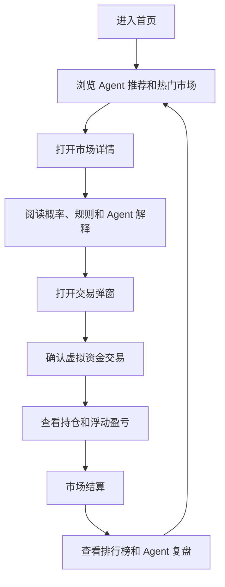
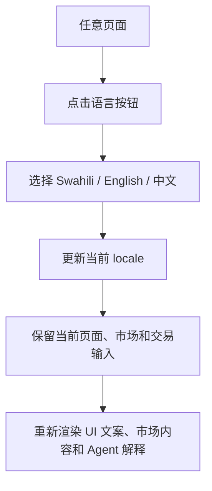

## 1. 产品概述

面向坦桑尼亚用户的本地事件预测 Web MVP，提供虚拟资金模拟交易、排行榜竞赛、Agent 市场解释和多语言体验。
- 解决用户理解预测市场门槛高、本地事件缺少可量化概率表达的问题。
- 第一版目标是验证用户是否愿意围绕足球、汇率、娱乐、加密等本地事件持续预测、分享和复盘。

## 2. 核心功能

### 2.1 用户角色

| 角色 | 注册方式 | 核心权限 |
|------|----------|----------|
| 普通用户 | 邮箱/手机号占位，MVP 可使用本地模拟身份 | 浏览市场、切换语言、使用虚拟资金交易、查看持仓和排行榜 |
| 运营用户 | 第一版不做后台登录，仅预留数据模型 | 创建市场、结算市场、配置推荐、处理争议 |
| Agent 助手 | 系统内置 | 解释市场概率、生成异动原因、提示风险、推荐关注市场 |

### 2.2 功能模块

1. **首页 Home**：英雄区、虚拟资金余额、Agent 今日推荐、热门市场、分类入口、排行榜预览。
2. **市场列表 Markets**：搜索、分类筛选、市场卡片、状态筛选、空状态和错误重试。
3. **市场详情 Market Detail**：市场标题、概率面板、历史趋势、交易入口、Agent 解释、结算规则、市场活动。
4. **交易弹窗 Trade Modal**：选择 YES/NO、输入虚拟金额、预览收益/亏损、确认模拟交易。
5. **持仓 Portfolio**：虚拟余额、总收益、胜率、开放持仓、已结算记录、Agent 复盘。
6. **排行榜 Leaderboard**：赛季榜、用户排名、Top 3 展示、分享入口、公平竞赛提示。
7. **Agent 页面**：每日简报、市场异动、风险提醒、问答入口。
8. **语言切换 Language Switcher**：Swahili、English、中文一键切换，默认 Swahili。
9. **新手引导 Onboarding**：解释概率、YES/NO、虚拟资金、结算和排行榜。

### 2.3 页面详情

| 页面名称 | 模块名称 | 功能描述 |
|----------|----------|----------|
| 首页 | Hero Glass Card | 展示产品定位、虚拟资金余额和开始预测 CTA |
| 首页 | Today by Agent | 展示 3 个 Agent 推荐市场及简短原因 |
| 首页 | Hot Markets | 展示足球、汇率、娱乐等热门市场卡片 |
| 首页 | Leaderboard Preview | 展示 Top 3 和当前用户排名 |
| 市场列表 | Search Bar | 按球队、汇率、艺人、事件搜索 |
| 市场列表 | Category Tabs | All、Football、Economy、Crypto、Entertainment、Weather |
| 市场列表 | Market Card | 展示标题、概率、成交量、交易人数、Agent 摘要 |
| 市场详情 | Probability Panel | 展示 YES/NO 概率、24h 变化和趋势图 |
| 市场详情 | Agent Explanation | 解释当前概率和主要风险 |
| 市场详情 | Rules | 展示截止时间、结算来源和争议说明 |
| 交易弹窗 | Trade Preview | 输入金额并展示潜在收益、潜在亏损和结算时间 |
| 持仓 | Balance Card | 展示 Demo Cash、Total PnL、Win Rate、Rank |
| 持仓 | Open Positions | 展示当前持仓、入场概率、当前概率和浮动盈亏 |
| 排行榜 | Season Header | 展示赛季名称、奖励说明和剩余时间 |
| 排行榜 | Ranking List | 展示排名、收益、胜率和参与市场数 |
| Agent | Daily Brief | 展示今日 5 个值得关注市场 |
| Agent | Market Movers | 展示概率变动最大的市场和原因 |
| Agent | Risk Alerts | 提示低流动性、规则模糊、临近截止等风险 |
| 语言切换 | Language Panel | 切换 Swahili、English、中文且不丢页面状态 |

## 3. 核心流程

用户进入首页后，先看到虚拟资金余额和 Agent 推荐市场；用户可进入市场详情，阅读概率、规则和 Agent 解释；随后打开交易弹窗，用虚拟资金买入 YES 或 NO；交易成功后进入持仓页查看盈亏；事件结算后进入排行榜和复盘，形成再次预测和分享。

语言切换流程：

## 4. 用户界面设计

### 4.1 设计风格

- 视觉方向：Premium Glass Trading Companion。
- 主色：深色背景 `#070A12`，蓝紫主色 `#7C5CFF`，青蓝辅助色 `#22D3EE`。
- 本地色：Tanzania green `#20C997` 少量用于国家身份和成功状态。
- 奖励色：金色 `#FBBF24` 仅用于排行榜、Top 3 和奖励提示。
- 风格：Apple 毛玻璃、大圆角、轻阴影、深色渐变、克制金融感。
- 字体：Swahili、英文使用 Inter 或等价现代无衬线；中文使用 PingFang SC / Noto Sans SC。
- 按钮：圆角胶囊按钮，主按钮蓝紫渐变，交易按钮按 YES/NO 区分但避免博彩化。
- 图标：线性图标为主，避免赌场、筹码、金币雨等视觉。

### 4.2 页面设计概览

| 页面名称 | 模块名称 | UI 元素 |
|----------|----------|---------|
| 首页 | Hero | 深色渐变背景、玻璃卡片、虚拟余额、主 CTA、柔和光斑 |
| 首页 | Agent 推荐 | 小型玻璃摘要卡、概率数字、风险标签、轻微 shimmer |
| 市场列表 | 市场卡片 | 大圆角卡片、2 行标题、YES/NO 概率、成交量、Agent 摘要 |
| 市场详情 | 概率面板 | 大数字概率、YES/NO 分段、趋势小图、24h 变化 |
| 交易弹窗 | 确认交易 | 半屏毛玻璃弹窗、金额快捷按钮、收益预览、Demo 标签 |
| 持仓 | 资产面板 | 余额、收益、胜率、排名，预留 Demo/Real 切换 |
| 排行榜 | 排名列表 | Top 3 金色层级、普通排名深色卡片、分享按钮 |
| Agent | 智能简报 | 摘要卡、异动卡、风险卡、问答输入框 |
| 语言切换 | 语言面板 | 当前语言高亮、四语言列表、切换后无刷新状态保持 |

### 4.3 响应式

- 采用移动优先 Web App，但桌面端必须可用。
- 移动端宽度优先适配 375px 到 430px。
- 底部 Tab 仅移动端展示，桌面端改为左侧导航。
- 桌面端采用三栏布局：左侧导航、中间主内容、右侧 Agent/排行榜/持仓摘要。
- 交互目标最小 44px，适配触摸操作。
- 长文本语言下卡片不能溢出；市场标题列表页最多 2 行，详情页完整展示。
