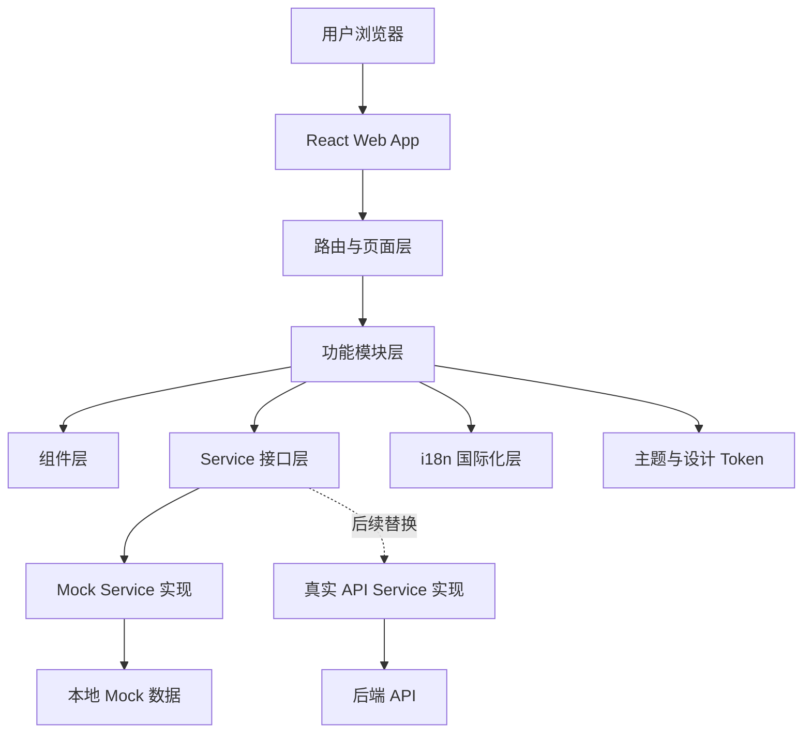
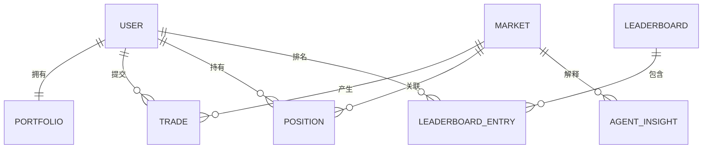

## 1. 架构设计

Web MVP 采用前端单页应用架构。第一版使用 Mock 数据，但所有数据访问必须经过 service 层，后续替换真实后端时不改页面组件。



分层说明：

- 页面层：Home、Markets、Market Detail、Portfolio、Leaderboard、Agent。
- 功能模块层：markets、trade、portfolio、leaderboard、agent、i18n。
- 组件层：AppShell、GlassCard、MarketCard、TradeModal、LanguageToggle 等。
- Service 层：统一定义数据接口，屏蔽 Mock 和真实后端差异。
- i18n 层：统一管理 UI 文案、语言切换和 locale 状态。

## 2. 技术说明

- 前端：React@18 + TypeScript + Vite。
- 样式：Tailwind CSS@3 + CSS variables。
- 路由：React Router。
- 状态：React hooks + Context，MVP 不引入复杂全局状态库。
- 国际化：自建轻量 i18n 或 i18next；若实现速度优先，先使用本地 JSON + Context。
- 图表：MVP 使用 CSS/SVG 简化趋势线，不引入大型图表库。
- 数据：Mock service + TypeScript interface。
- 初始化工具：Vite。

技术原则：

- UI 组件不能直接 import mock 数据。
- 展示文案不能硬编码，必须走 i18n key。
- 交易组件必须支持 `demo` / `real` 参数，第一版只启用 `demo`。
- 余额模型必须同时预留 `demoBalance` 和 `realBalance`。
- 市场内容必须支持多语言字段。
- Agent service 必须接受 `locale` 参数。

## 3. 路由定义

| 路由 | 用途 |
|------|------|
| `/` | 重定向到默认语言 `/sw` |
| `/:locale` | 首页，展示热门市场和 Agent 推荐 |
| `/:locale/markets` | 市场列表与筛选 |
| `/:locale/markets/:marketId` | 市场详情和交易入口 |
| `/:locale/portfolio` | 用户虚拟持仓与收益 |
| `/:locale/leaderboard` | 模拟交易排行榜 |
| `/:locale/agent` | Agent 简报、异动和风险提醒 |
| `/:locale/onboarding` | 新手引导 |

支持的 locale：

```ts
type Locale = 'sw' | 'en' | 'zh';
const DEFAULT_LOCALE: Locale = 'sw';
```

## 4. API 定义

第一版没有真实后端，但必须按照真实 API 的方式定义 service contract。

### 4.1 MarketService

```ts
export type ListMarketParams = {
  locale: Locale;
  category?: MarketCategory | 'all';
  query?: string;
  filter?: 'ending-soon' | 'high-volume' | 'agent-picked' | 'low-risk';
};

export interface MarketService {
  listMarkets(params: ListMarketParams): Promise<Market[]>;
  getMarket(id: string, locale: Locale): Promise<Market>;
}
```

### 4.2 TradeService

```ts
export type TradeMode = 'demo' | 'real';

export type TradePreviewInput = {
  marketId: string;
  outcomeId: 'yes' | 'no';
  amount: number;
  mode: TradeMode;
};

export type TradePreview = {
  marketId: string;
  outcomeId: 'yes' | 'no';
  amount: number;
  entryProbability: number;
  potentialPayout: number;
  potentialProfit: number;
  maxLoss: number;
  mode: TradeMode;
};

export type SubmitTradeInput = TradePreviewInput;

export interface TradeService {
  previewTrade(input: TradePreviewInput): Promise<TradePreview>;
  submitTrade(input: SubmitTradeInput): Promise<Trade>;
}
```

### 4.3 PortfolioService

```ts
export interface PortfolioService {
  getPortfolio(userId: string, locale: Locale): Promise<Portfolio>;
}
```

### 4.4 AgentService

```ts
export type AgentInsightType = 'daily-brief' | 'market-mover' | 'risk-alert' | 'market-explanation';

export interface AgentService {
  getDailyBrief(locale: Locale): Promise<AgentInsight[]>;
  getMarketExplanation(marketId: string, locale: Locale): Promise<AgentInsight>;
  getRiskAlerts(locale: Locale): Promise<AgentInsight[]>;
}
```

### 4.5 LeaderboardService

```ts
export interface LeaderboardService {
  getSeasonLeaderboard(locale: Locale): Promise<Leaderboard>;
}
```

## 5. 数据模型

### 5.1 数据模型定义



### 5.2 TypeScript 数据定义

```ts
export type Locale = 'sw' | 'en' | 'zh';

export type MarketCategory =
  | 'football'
  | 'economy'
  | 'crypto'
  | 'entertainment'
  | 'weather';

export type LocalizedText = Record<Locale, string>;

export type Market = {
  id: string;
  category: MarketCategory;
  localizedContent: Record<Locale, {
    title: string;
    description: string;
    rules: string;
    resolutionSource: string;
  }>;
  outcomes: Array<{
    id: 'yes' | 'no';
    label: LocalizedText;
    probability: number;
  }>;
  volume: number;
  traders: number;
  endsAt: string;
  status: 'open' | 'closed' | 'settled';
  mode: 'demo' | 'real-ready';
  agentSummary: LocalizedText;
  riskTags: Array<'low-liquidity' | 'ambiguous-rules' | 'ending-soon' | 'high-volatility'>;
  sparkline: number[];
};

export type Portfolio = {
  userId: string;
  demoBalance: number;
  realBalance?: number;
  currency: 'DEMO' | 'TZS' | 'USDC';
  kycStatus?: 'not-started' | 'pending' | 'approved' | 'rejected';
  positions: Position[];
  settledTrades: Trade[];
  totalPnl: number;
  winRate: number;
  rank: number;
};

export type Position = {
  id: string;
  marketId: string;
  outcomeId: 'yes' | 'no';
  amount: number;
  entryProbability: number;
  currentProbability: number;
  unrealizedPnl: number;
  mode: 'demo' | 'real';
};

export type Trade = {
  id: string;
  marketId: string;
  outcomeId: 'yes' | 'no';
  mode: 'demo' | 'real';
  amount: number;
  entryProbability: number;
  createdAt: string;
  status: 'pending' | 'confirmed' | 'failed';
};

export type AgentInsight = {
  id: string;
  type: AgentInsightType;
  marketId?: string;
  title: LocalizedText;
  body: LocalizedText;
  confidence: 'low' | 'medium' | 'high';
  riskTags?: Market['riskTags'];
};

export type Leaderboard = {
  seasonId: string;
  title: LocalizedText;
  endsAt: string;
  entries: LeaderboardEntry[];
};

export type LeaderboardEntry = {
  userId: string;
  displayName: string;
  country: 'TZ';
  rank: number;
  pnl: number;
  winRate: number;
  marketsTraded: number;
};
```

## 6. 文件结构

```text
src/
  app/
    App.tsx
    routes.tsx
  components/
    AppShell.tsx
    GlassCard.tsx
    LanguageToggle.tsx
    MarketCard.tsx
    ProbabilityPill.tsx
    TradeModal.tsx
    AgentInsightCard.tsx
  features/
    markets/
      MarketsPage.tsx
      MarketDetailPage.tsx
    portfolio/
      PortfolioPage.tsx
    leaderboard/
      LeaderboardPage.tsx
    agent/
      AgentPage.tsx
    onboarding/
      OnboardingPage.tsx
    i18n/
      I18nProvider.tsx
      locales/
  services/
    marketService.ts
    tradeService.ts
    portfolioService.ts
    agentService.ts
    leaderboardService.ts
  mocks/
    markets.ts
    portfolio.ts
    leaderboard.ts
    agent.ts
  types/
    domain.ts
  styles/
    index.css
```

## 7. 多语言架构

文案文件：

```text
src/features/i18n/locales/
  sw/common.json
  sw/home.json
  sw/market.json
  sw/trade.json
  sw/portfolio.json
  sw/agent.json
  en/...
  zh/...
```

要求：

- `LanguageToggle` 负责切换 locale。
- locale 写入 URL 与 localStorage。
- URL locale 优先级高于 localStorage。
- 无效 locale fallback 到 `sw`。
- 切换语言不重置交易弹窗输入和当前市场。

## 8. 真实后端兼容策略

第一版实现 mock service：

- `mockMarketService`
- `mockTradeService`
- `mockPortfolioService`
- `mockAgentService`
- `mockLeaderboardService`

后续接真实后端时：

- 新增 `apiMarketService` 等实现。
- 保持 service interface 不变。
- 页面和组件不直接改动。
- 如后端字段不同，通过 adapter 转换为前端 domain model。

## 9. 钱包、支付、真钱兼容策略

第一版只展示 Demo 模式，但保留以下字段和 UI 插槽：

- `mode: 'demo' | 'real'`
- `demoBalance`
- `realBalance`
- `currency: 'DEMO' | 'TZS' | 'USDC'`
- `kycStatus`
- Deposit / Withdraw 插槽
- Payment Method 插槽
- Wallet Connect 插槽

真实交易入口默认隐藏或 disabled，文案为 `Real-money trading is not enabled in this MVP.`

## 10. 验收标准

- 所有核心页面可访问并可点击。
- 默认进入斯瓦希里语。
- 支持 Swahili、English、中文切换。
- 语言切换不丢当前页面状态。
- 用户可完成一次 demo trade。
- 交易后持仓页显示新持仓。
- Agent 页面展示简报、异动和风险提醒。
- UI 数据全部来自 service 层。
- 组件不直接 import mock 数据。
- TradeModal 支持 `demo` / `real` 参数。
- 375px 移动宽度下可用。
- 1440px 桌面宽度下布局合理。
- Loading、empty、error 状态可见。
- 主要按钮和输入具备 focus 状态。
